# FineGrained-ImageClassification-CAL

NYCU-2021Fall-VRDL-HW1

- [Introduction](#Introduction)
- [Methodology](#Methodology)
- [How to train](#Train)
- [How to inference](#Inference)
- [Pretrained-model](#Pretrained-model)
- [Reference](#Reference)

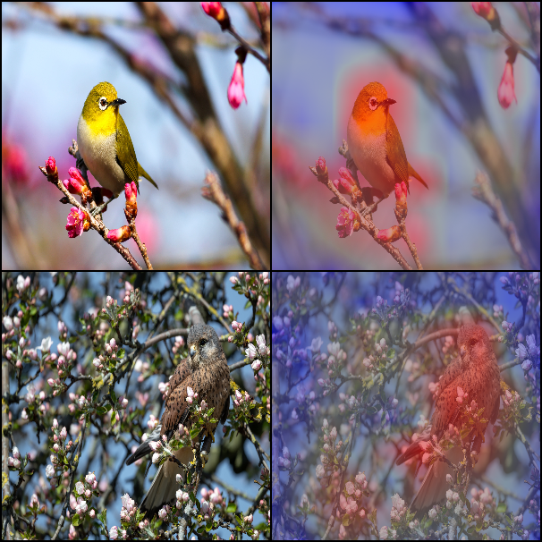
Sources of original images in the grid:

[1](https://unsplash.com/photos/LrT4NeshrtI?utm_source=unsplash&utm_medium=referral&utm_content=creditShareLink)
[2](https://unsplash.com/photos/RLLR0oRz16Y?utm_source=unsplash&utm_medium=referral&utm_content=creditShareLink)


## Introduction

The goal of this project is to do bird image classification.

- Number of training images: 3000
- Number of testing images: 3033
- Number of classes: 200 (15 images per class)

Each class is one category of bird. This kind of task is also called "fine-grained" image classification. All classes share similar characteristics, and there is no significant difference between each class.

## Methodology

### Dataset-Level Data Augmentation

Training data: 

- Resize to (height, width) = (324, 324)
- Randomly rotate within 20 degrees
- Randomly horizontal-flip with probability 50%
- Randomly crop into size of (300, 300)
- Normalize: means of 3 channels = (0.48194, 0.49756, 0.43214); stdev of 3 channels: (0.13271, 0.12794, 0.17289))

Validation data & testing data:

- Resize to (height, width) = (324, 324)
- Centrally crop into size of (300, 300)
- Normalize: means of 3 channels = (0.48194, 0.49756, 0.43214); stdev of 3 channels: (0.13271, 0.12794, 0.17289)

P.S. (0.48194, 0.49756, 0.43214) and (0.13271, 0.12794, 0.17289) are calculated from the whole training data (not including validation data).

### Counterfactual Attention Learning (CAL) with Weakly Supervised Data Augmentation Network (WS-DAN)

The weakly supervised data augmentation network (WS-DAN) utilizes an attention mechanism to do attention cropping and dropping for **extra data augmentation** in each batch. Counterfactual attention learning takes advantage of **counterfactual attention** (random attention is adopted here) to force the model to improve the prediction based on wrong attentions and make decisions based more on main clues.

#### Model Architecture

Model is composed of:

1. Backbone: any backbone network architecture. ResNet152 with pre-trained weights is used here.
2. Attention convolution layer: Conv2d + Batch Normalization + ReLU
3. Fully-connected layer: receive feature matrix from bilinear attention pooling (BAP) and output predicting probabilities.

#### Loss Function

There are 2 network forwarding in a training batch. Inputs of the first forwarding are ordinary images from the data-loader. Inputs of the second forwarding are augmented data by the attention cropping and dropping mechanism.

## Train

### First-time settings of main.ipynb

Provide the value of constants (e.g. where are the training images) in preparing section.

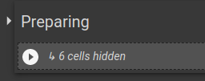
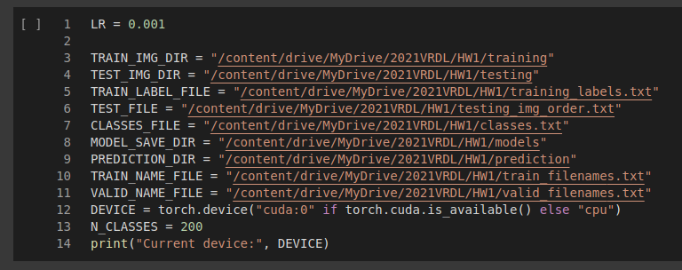

### Each time you start your jupyter runtime

1. Run the following 4 sections: preparing, load-data, model class, and train function

    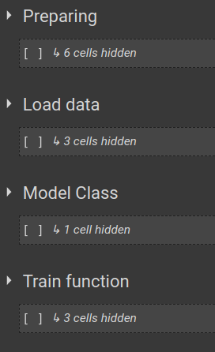

2. Create a new model or load one. Operate in training setting section. Pick one of the three to run.
   If you want to run ResNet without CAL & WS-DAN, you have to run "Only resnet train func" section, too.

    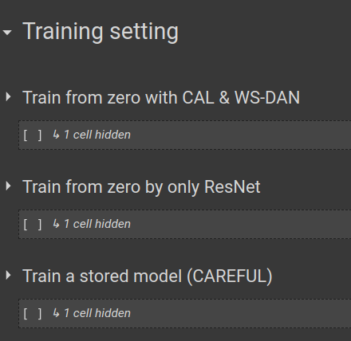

### Start training

Run the train cell to train your model.
 
If your model is loaded from a existing model and want to train it again,
you should provide "previous_record" with "PREVIOUS_RECORD".

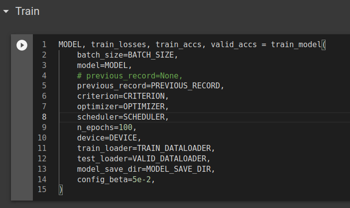

If your model is just created from, give previous_record "None" like the below picture:

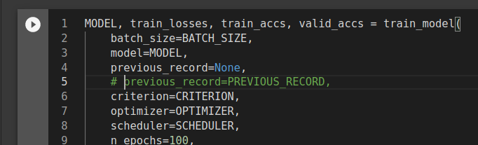

### Change learning rate manually

Scheduler is set, but if you want to change the learning rate, you can run this:

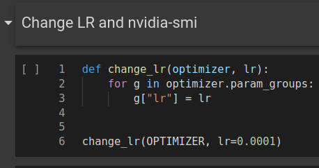

### Design how to predict

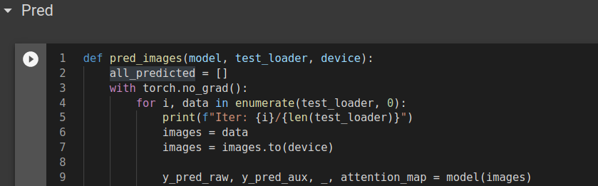

You can design the way to predict. For example, only use the raw prediction.
You can also try to mix raw prediction with prediction from augmentation data and average them such as:

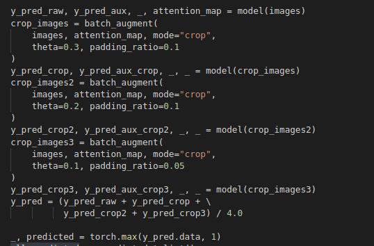

### Plot attention

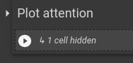

### Show cropping example

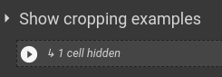


## Inference

Use python3 to run "inference.py". 
Before running, you should modify the value of constant in inference.py first.

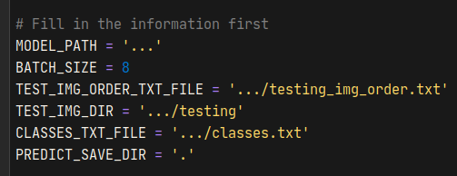

It will produce a answer.txt in the PREDICT_SAVE_DIR.

## Pretrained Model

File on Google Drive: [link](https://drive.google.com/file/d/1EIOhpH9T6hTm1jLD32w-UtycMIx6KyF9/view?usp=sharing)

Its training outputs: [here](training_outputs.md)

## Reference

- Rao, Y., Chen, G., Lu, J., & Zhou, J. (2021). Counterfactual Attention Learning for Fine-Grained Visual Categorization and Re-identification. In *ICCV*.
    
    code: [https://github.com/raoyongming/CAL](https://github.com/raoyongming/CAL)
    
    paper: [arXiv:2108.08728](https://arxiv.org/abs/2108.08728) [cs.CV]
    
    ```
    @inproceedings{rao2021counterfactual,
      title={Counterfactual Attention Learning for Fine-Grained Visual Categorization and Re-identification},
      author={Rao, Yongming and Chen, Guangyi and Lu, Jiwen and Zhou, Jie},
      booktitle={ICCV},
      year={2021}
    }
    ```
    
- Tao Hu, Honggang Qi, Qingming Huang, & Yan Lu. (2019). See Better Before Looking Closer: Weakly Supervised Data Augmentation Network for Fine-Grained Visual Classification.
    ```
    @misc{hu2019better,
          title={See Better Before Looking Closer: Weakly Supervised Data Augmentation Network for Fine-Grained Visual Classification}, 
          author={Tao Hu and Honggang Qi and Qingming Huang and Yan Lu},
          year={2019},
          eprint={1901.09891},
          archivePrefix={arXiv},
          primaryClass={cs.CV}
    }
    ```

- [https://www.kaggle.com/deepbear/pytorch-car-classifier-90-accuracy](https://www.kaggle.com/deepbear/pytorch-car-classifier-90-accuracy)
- Identity: [https://discuss.pytorch.org/t/how-to-delete-layer-in-pretrained-model/17648](https://discuss.pytorch.org/t/how-to-delete-layer-in-pretrained-model/17648)

## Cover image sources
